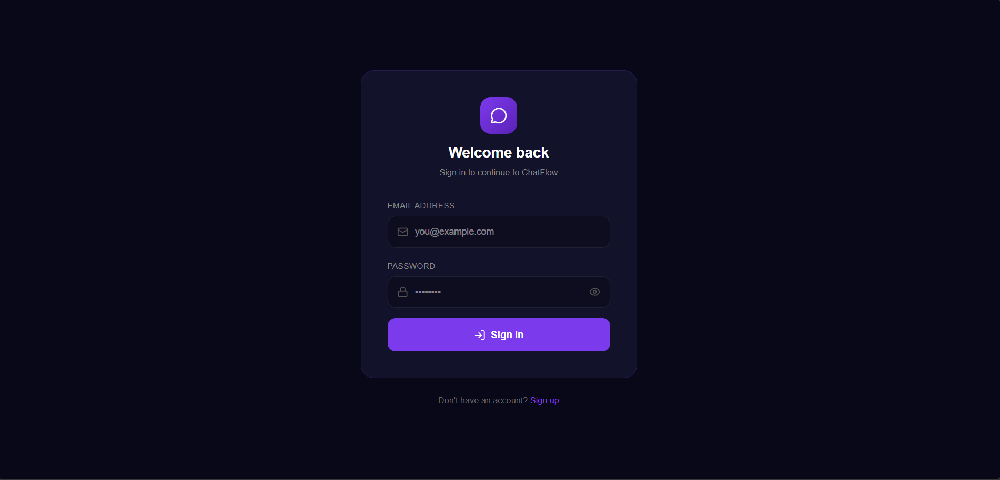
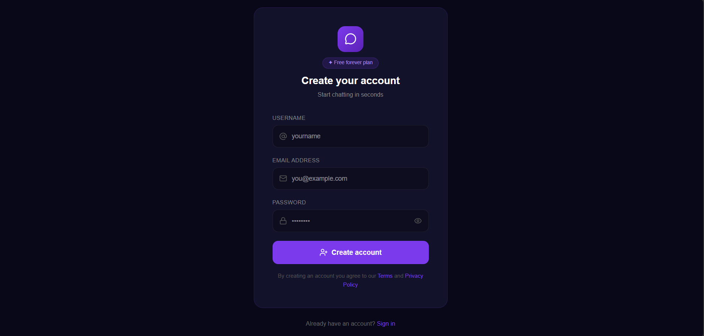
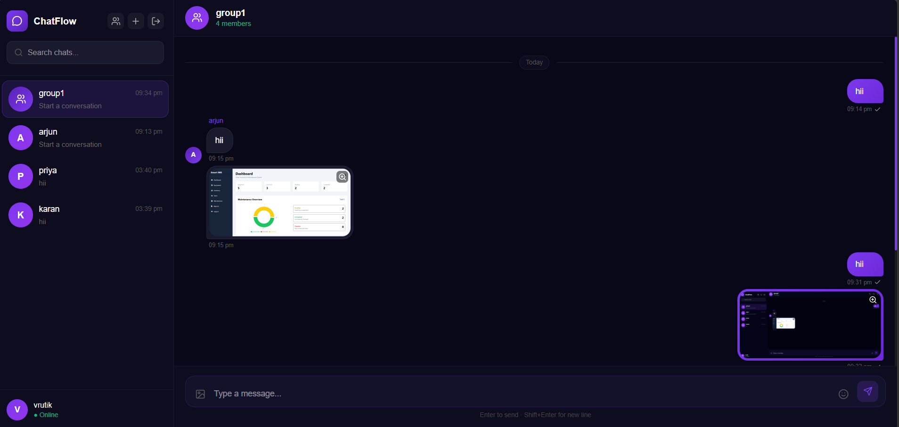

# 💬 ChatFlow - Real-Time Chat Application

A modern full-stack real-time chat application built using the MERN stack with **Socket.IO** for instant communication. ChatFlow provides secure authentication, one-to-one and group conversations, live typing indicators, online presence tracking, image sharing through Cloudinary, and a clean responsive user interface.


---

## 🚀 Live Demo

🌐 **Frontend:** https://your-frontend-url.vercel.app

🔗 **Backend API:** https://your-backend-url.onrender.com

---

# 📸 Screenshots

## Login



---

## Register



---

## Chat Interface



---

# ✨ Features

### 🔐 Authentication

- User Registration
- User Login
- JWT Authentication
- HTTP-only Cookies
- Password Encryption using bcryptjs
- Protected Routes

---

### 💬 Real-Time Messaging

- Instant Messaging using Socket.IO
- One-to-One Chat
- Group Chat
- Message History
- Image Sharing
- Online / Offline Status
- Typing Indicator
- Seen Status
- Responsive Chat UI

---

### 🖼 Image Sharing

- Upload Images
- Cloudinary Integration
- Image Preview
- Lazy Loading
- Full Screen Image Viewer

---

### 👥 Group Chat

- Create Groups
- Multiple Members
- Live Group Messaging

---

### 🎨 User Interface

- Modern Dark Theme
- Purple Accent Design
- Responsive Layout
- Glassmorphism Inspired Design
- Animated Message Bubbles
- Responsive Sidebar
- Search Chats

---

## 🛠 Tech Stack

### Frontend

- React
- Vite
- React Router
- Zustand
- Axios
- Socket.IO Client
- Tailwind CSS
- Lucide React

---

### Backend

- Node.js
- Express.js
- MongoDB
- Mongoose
- Socket.IO
- JWT
- bcryptjs
- Multer
- Cloudinary

---

### Database

- MongoDB Atlas

---

# 📂 Project Structure

```
real-time-chat-application/
│
├── client/
│   ├── src/
│   ├── public/
│   └── package.json
│
├── server/
│   ├── config/
│   ├── controllers/
│   ├── middleware/
│   ├── models/
│   ├── routes/
│   ├── sockets/
│   ├── utils/
│   └── server.js
│
└── README.md
```

---

# ⚙️ Installation

## Clone Repository

```bash
git clone https://github.com/Vrutik-Sotha/real-time-chat-application.git
cd real-time-chat-application
```

---

## Install Backend

```bash
cd server
npm install
```

---

## Install Frontend

```bash
cd ../client
npm install
```

---

# 🔑 Environment Variables

### Server (.env)

```env
PORT=5000

MONGODB_URI=your_mongodb_connection_string

JWT_SECRET=your_jwt_secret

CLIENT_URL=http://localhost:5173

CLOUDINARY_CLOUD_NAME=your_cloud_name
CLOUDINARY_API_KEY=your_api_key
CLOUDINARY_API_SECRET=your_api_secret
```

---

# ▶ Running the Application

## Backend

```bash
cd server
npm run dev
```

---

## Frontend

```bash
cd client
npm run dev
```

---

# 🔄 Real-Time Events

- User Login
- User Disconnect
- Send Message
- Receive Message
- Typing Indicator
- Stop Typing
- Seen Status
- Online Status
- Image Messages

---

# 🔒 Security Features

- JWT Authentication
- HTTP-only Cookies
- Password Hashing
- Protected APIs
- Input Validation
- Secure Image Upload
- MongoDB Validation

---

# 📈 Future Improvements

- Message Reactions
- Edit Messages
- Delete Messages
- Push Notifications
- Voice Messages
- Read Receipts per Group Member
- Message Search

---

# 📚 What I Learned

During this project I gained hands-on experience with:

- Building scalable MERN applications
- Real-time communication using Socket.IO
- Authentication using JWT and HTTP-only cookies
- MongoDB schema design
- State management with Zustand
- Image uploads using Multer and Cloudinary
- REST APIs with Express
- Deployment-ready project architecture

---

# 🤝 Contributing

Pull requests are welcome.

For major changes, please open an issue first to discuss your ideas.

---

# 📄 License

This project is licensed under the MIT License.

---

# 👨‍💻 Author

**Vrutik Sotha**

GitHub: https://github.com/Vrutik-Sotha

